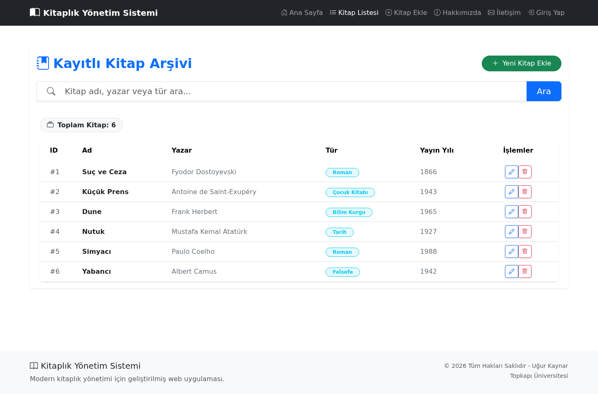
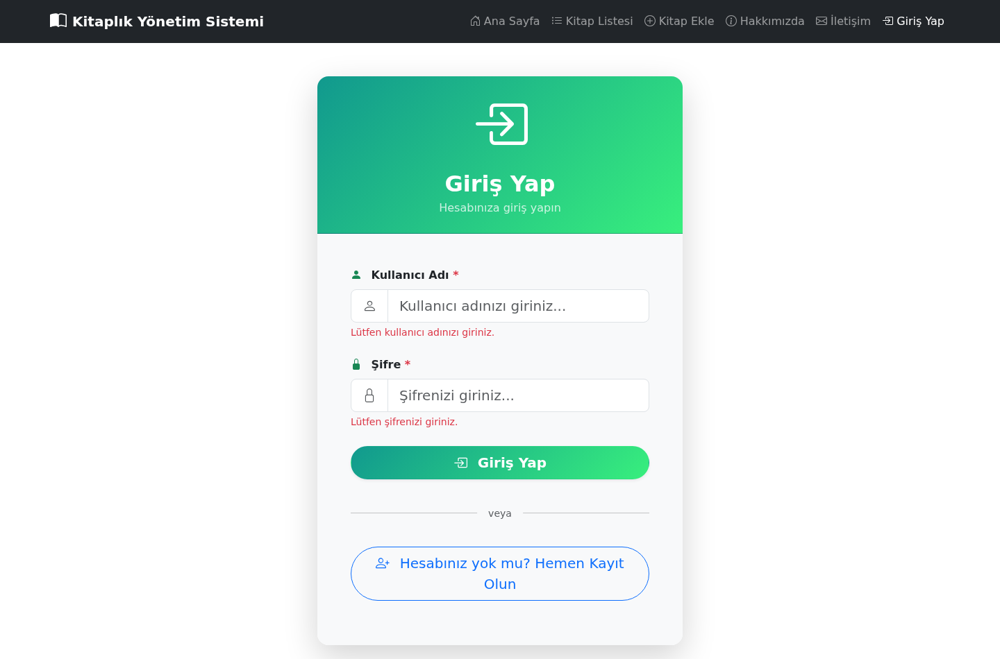
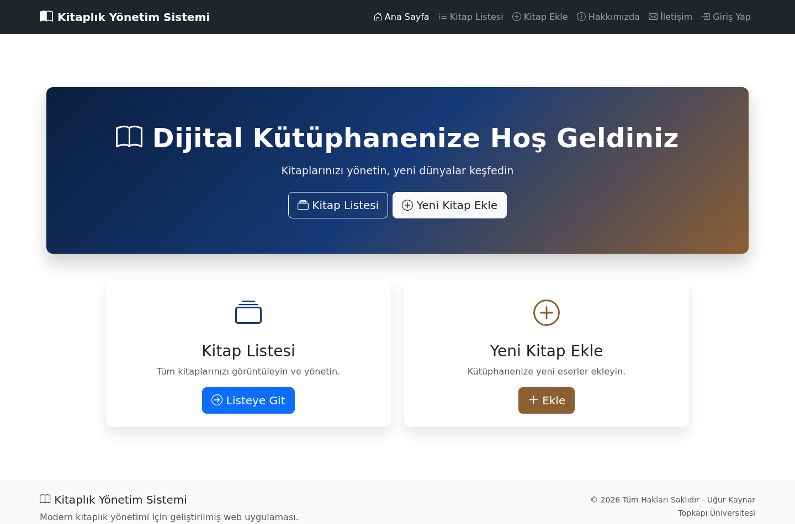

# 📚 Library Management System — Kitaplık Yönetim Sistemi

A full-stack web application for managing a personal book library. Users can register, log in, and manage their book collection with full CRUD operations, search, and persistent storage.
> 🔗 **Live Demo:** [kitaplik-yonetim-sistemi.onrender.com](https://kitaplik-yonetim-sistemi.onrender.com) — demo account: `demo` / `demo1234`



## ✨ Features

- 🔐 **User authentication** — register & login with bcrypt-hashed passwords and session management
- 🛡️ **Route protection** — book management routes require authentication (custom middleware)
- 📖 **Full CRUD** — add, edit, delete and list books
- 🔎 **Live search** — filter books by title or author (case-insensitive)
- ✅ **Server-side validation** — all form data validated on both client and server
- 💾 **Persistent storage** — SQLite database (WAL mode), data survives server restarts
- 🎨 **Responsive UI** — Bootstrap 5 with custom styling, 404 & error pages

| Giriş / Login | Ana Sayfa / Home |
|:---:|:---:|
|  |  |

## 🛠️ Tech Stack

| Layer | Technology |
|---|---|
| Runtime | Node.js (18+) |
| Framework | Express 5 |
| Database | SQLite (better-sqlite3, WAL mode) |
| Auth | express-session + bcryptjs |
| Template engine | EJS (with partials) |
| Frontend | Bootstrap 5, Bootstrap Icons |

## 🚀 Getting Started

### Prerequisites

- [Node.js](https://nodejs.org) 18 or newer

### Installation

```bash
# 1) Clone the repository
git clone https://github.com/ugurkaynar/kitaplik-yonetim-sistemi.git
cd kitaplik-yonetim-sistemi

# 2) Install dependencies
npm install

# 3) Create your environment file
cp .env.example .env
#    → edit SESSION_SECRET with any long random string

# 4) (Optional) Load sample data + demo account
npm run seed

# 5) Start the server
npm start        # production
npm run dev      # development (auto-restart on changes)
```

Then open **http://localhost:3000** in your browser.

### Demo Account

After running `npm run seed`:

```
Username: demo
Password: demo1234
```

## 📁 Project Structure

```
├── app.js               # Express app: routes, middleware, validation
├── db.js                # SQLite connection & schema
├── seed.js              # Sample data loader
├── data/                # SQLite database file (gitignored)
├── views/
│   ├── partials/        # Header & footer components
│   ├── home.ejs         # Landing page
│   ├── index.ejs        # Book list + search
│   ├── add-book.ejs     # New book form
│   ├── edit-book.ejs    # Edit book form
│   ├── login.ejs        # Login & register forms
│   └── 404.ejs          # Not-found page
├── public/              # Static assets
└── docs/                # Screenshots
```

## 🔒 Security Notes

- Passwords are **never stored in plain text** — hashed with bcrypt (10 rounds)
- Session cookie is `httpOnly` (protected from XSS cookie theft)
- All mutating routes (`add / edit / delete`) require an authenticated session
- Book deletions use **POST** forms (not GET links) with a confirmation dialog
- Secrets (session key) are loaded from `.env`, which is gitignored
- SQL queries use **prepared statements** (protection against SQL injection)

## 🗺️ Roadmap

- [ ] Pagination for large libraries
- [ ] Book cover images
- [ ] User-specific libraries (multi-tenant)
- [ ] REST API endpoints
- [ ] Deployment (Render / Railway)

## 📄 License

MIT — see the [LICENSE](LICENSE) file.
